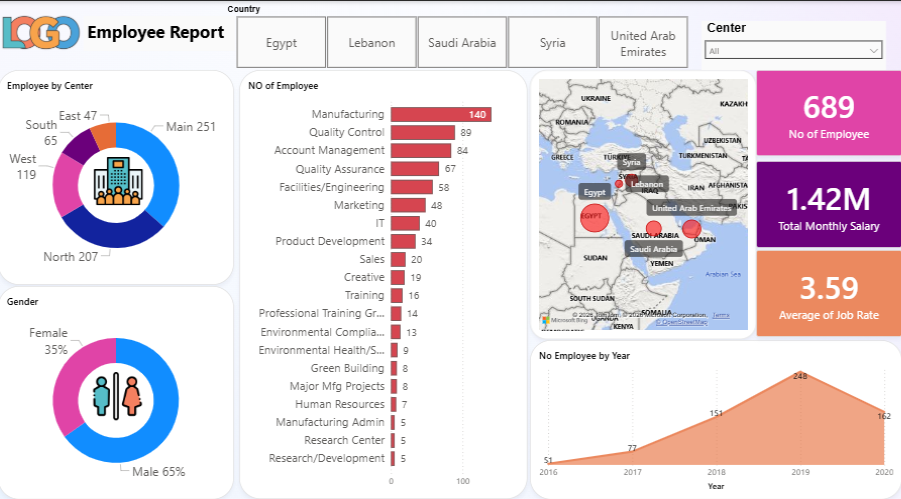

# 📊 Employee Report Dashboard

An interactive HR Analytics Dashboard built with **Power BI**, providing a comprehensive 
view of workforce data across 5 countries in the Middle East region.

## 🖼️ Preview

## 📌 Overview
This dashboard enables HR managers and executives to explore and analyze employee data 
across multiple dimensions — departments, regions, gender, salary, and hiring trends.

## ✨ Features
- 🌍 **Geographic Distribution** — Interactive map across Egypt, Lebanon, Saudi Arabia, Syria & UAE
- 🏢 **Department Breakdown** — Headcount across 20+ departments (Manufacturing, QC, IT, R&D...)
- 👥 **Gender Analysis** — Male/Female ratio visualization
- 🏬 **Center Distribution** — North, South, East, West & Main branches
- 💰 **Salary KPIs** — Total monthly salary ($1.42M) and average job rate (3.59)
- 📈 **Year-over-Year Trend** — Employee growth from 2016 to 2020
- 🔍 **Interactive Filters** — Filter by Country and Center

## 📊 Key Metrics
| Metric | Value |
|--------|-------|
| Total Employees | 689 |
| Total Monthly Salary | $1.42M |
| Average Job Rate | 3.59 |
| Countries Covered | 5 |
| Departments | 20+ |

## 🛠️ Tools & Technologies
- **Power BI Desktop**
- **DAX** (Data Analysis Expressions)
- **Power Query** for data transformation

## 📁 Project Structure
